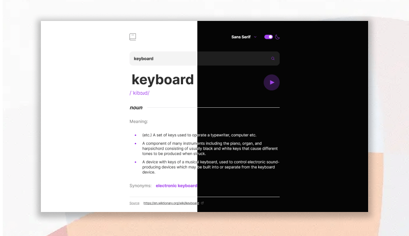

# Aplicación de diccionario en inglés

Este proyecto es una aplicación de diccionario desarrollada con JavaScript, HTML y CSS utilizando la API [Free Dictionary API](https://dictionaryapi.dev/). La aplicación permite a los usuarios buscar el significado de palabras en inglés y muestra sus definiciones, sinónimos y antónimos. También incluye funcionalidades para cambiar el color del tema (claro u oscuro), cambiar la tipografía y reproducir la pronunciación de las palabras buscadas.

La idea original para el proyecto fue propuesta por Frontend Mentor. Para obtener más detalles, puedes visitar [este enlace](https://www.frontendmentor.io/challenges/dictionary-web-app-h5wwnyuKFL/hub).

## Links

Netlify: https://dictionary-app-bootcamp.netlify.app/

## Tecnologías utilizadas

- JavaScript
- HTML
- CSS
- [Webpack](https://pugjs.org/api/getting-started.html)
- [Pug](https://pugjs.org/api/getting-started.html) (preprocesador de HTML)
- [Sass](https://sass-lang.com/) (preprocesador de CSS)
- [npm](https://www.npmjs.com/)

## Instalación

Antes de poder ejecutar la aplicación en tu equipo, debes asegurarte de tener instalado Node.js (versión 18.12.1) y npm (versión 8.19.2). Puedes descargarlos desde la página oficial de [Node.js](https://nodejs.org/es).

Clona el repositorio

    git clone https://github.com/Javieer57/dictonary-app.git

Instala las dependencias

    npm install

Ejecuta la aplicación

    npm run serve

## Creación de build

Genera el build de desarrollo

    npm run dev

Genera el build de producción

    npm run build
